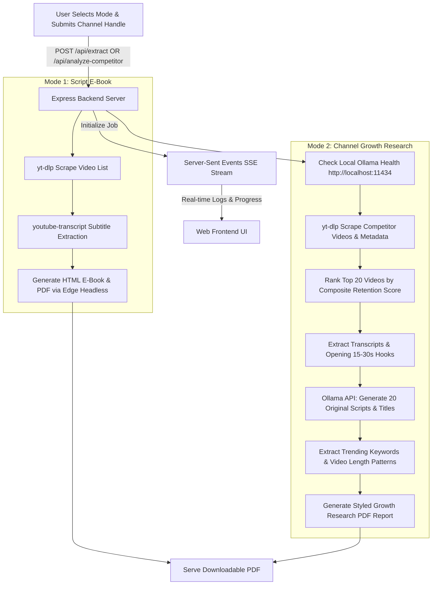

# 🚀 YouTube Script PDF & Channel Growth Research Studio


> **Full-Stack Web Application for YouTube Channel Script PDF Extraction & Competitor Growth Research using Local Ollama LLM.**

---

## 🌟 Overview

The **YouTube Script PDF & Channel Growth Research Studio** provides two powerful local workflows for content creators and researchers:

1. 📕 **Script PDF Downloader**: Extract complete video transcripts & metadata from any YouTube channel and compile them into a styled PDF E-Book with Table of Contents and Devanagari Hindi font support.
2. 🚀 **Channel Growth Research Mode (Local Ollama LLM)**:
   - **Competitor Top-Performer Finder**: Rank channel videos using a composite view-retention & engagement score.
   - **Hook Extractor**: Isolate the first 15–30 seconds of transcript text across top videos.
   - **Local LLM New Script Generator**: Use local Ollama (`llama3.1` or `mistral`) to write 20 original, non-paraphrased video scripts on competitor topics with strict copyright guardrails.
   - **Title Generator**: Produce 5–10 catchy high-CTR title suggestions per new script.
   - **Niche Trend & Duration Analysis**: Extract trending niche keywords and identify the optimal video duration category.

---

## ✨ Key Features

- 🎯 **Universal Channel Extraction**: Extract transcripts & metadata from any YouTube Channel URL or handle (`@channelname`).
- 🤖 **Local & Free AI Generation**: Powered by your local Ollama server (`http://localhost:11434`), requiring zero external API keys or cloud costs.
- 🛡️ **Copyright Guardrails**: Explicit LLM prompts enforce 100% fresh script structure, unique hook, and new examples without copying source text.
- 🇮🇳 **Flawless Hindi & Devanagari Font Support**: Uses Noto Sans Devanagari & Mangal font fallbacks to render Hindi text accurately in PDFs.
- ⚡ **Real-Time SSE Progress Stream**: Live progress bar (0%–100%) and streaming console logs.
- 🎨 **Dark-Mode Glassmorphism UI**: Built with Tailwind CSS and responsive design.

---

## 🔄 System Architecture & Workflow



---

## 📁 Project Directory Structure

```text
YouTube-Script-PDF-Generator/
├── lib/
│   ├── local_llm.js            # Ollama API wrapper & health check
│   ├── competitor_analyzer.js   # Scoring, hook extraction & niche keyword trends
│   └── competitor_report_pdf.js# PDF report HTML renderer
├── public/
│   └── index.html              # Dual-Mode Web UI (Tailwind CSS, Glassmorphism)
├── server.js                   # Express Backend Server & API routes
├── yt-dlp.exe                  # YouTube video metadata scraper
├── package.json                # Dependencies & scripts
└── README.md                   # Complete Documentation
```

---

## 🛠️ Local Setup & Requirements

### 1. Prerequisites
- **Node.js**: v18+ (tested on v22)
- **Ollama**: Download & install from [Ollama.com](https://ollama.com)
- **Pull LLM Model**:
  ```bash
  ollama pull llama3.1
  ```

### 2. Install & Start Server

```bash
git clone https://github.com/sonuukush/YouTube-Script-PDF-Generator.git
cd YouTube-Script-PDF-Generator
npm install
npm start
```

### 3. Open in Browser

👉 **`http://localhost:3000`**

---

<p align="center">Made with ❤️ for Content Creators, Researchers & Developers</p>
