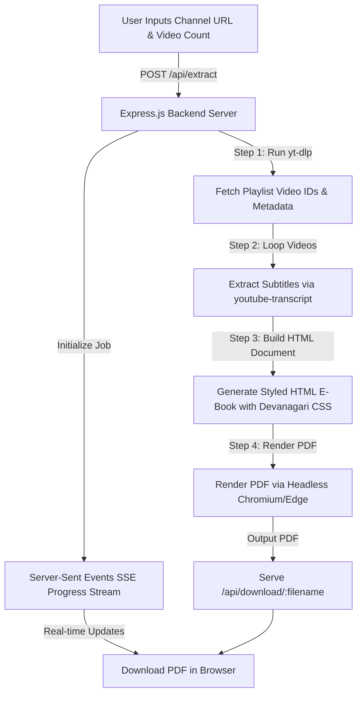

# 📕 YouTube Script PDF Generator


> **Full-Stack Web Application to extract video transcripts & titles from any YouTube channel and compile them into beautifully styled, downloadable PDF E-Books with Hindi/Devanagari font support.**

---

## 🌟 Overview

The **YouTube Script PDF Generator** is an automated Web Application that fetches video titles, URLs, metadata, and full transcripts (subtitles) from any YouTube Channel handle or URL (e.g., `@CodeWithHarry`, `@TechnicalGuruji`, `@MrBeast`).

It compiles channel video scripts into a professional PDF E-Book with a cover page, Table of Contents with jump links, per-video word counts, and full Devanagari Hindi character support.

---

## ✨ Key Features

- 🎯 **Universal Channel Extraction:** Extract video scripts from any YouTube Channel URL or handle (`@channelname`).
- 🎛️ **Custom Video Count Limits:** Flexible extraction scope options (**Latest 10, 20, 50, 80, 100, or ALL Videos**) to handle channels with thousands of uploads.
- 🇮🇳 **Flawless Hindi & Devanagari Font Support:** Uses Noto Sans Devanagari & Mangal font fallbacks to guarantee proper Hindi character rendering in generated PDFs.
- 📋 **Interactive Table of Contents:** Automatically generates an indexed TOC with anchor links and script word counts.
- ⚡ **Real-Time SSE Live Progress Stream:** Live progress bar (0% - 100%) and streaming console logs directly in the browser.
- 🎨 **Dark-Mode Glassmorphism UI:** Built with Tailwind CSS and responsive design for high aesthetic appeal.

---

## 🔄 System Architecture & Workflow



---

## 📁 Project Directory Structure

```text
YouTube-Script-PDF-Generator/
├── public/
│   └── index.html              # Web Frontend UI (Tailwind CSS, Glassmorphic UI)
├── server.js                   # Express Backend Server & API routes
├── yt-dlp.exe                  # Standalone YouTube video metadata scraper
├── package.json                # Dependencies & scripts
└── README.md                   # Complete Documentation
```

---

## 🛠️ Installation & Local Setup

### 1. Clone the Repository

```bash
git clone https://github.com/sonuukush/YouTube-Script-PDF-Generator.git
cd YouTube-Script-PDF-Generator
```

### 2. Install Dependencies

```bash
npm install
```

### 3. Start the Server

```bash
npm start
# OR
node server.js
```

### 4. Open in Browser

Open your browser and navigate to:

👉 **`http://localhost:3000`**

---

## 📡 API Endpoints

- `POST /api/extract`: Accepts `{ channelUrl, videoLimit }` to start extraction.
- `GET /api/progress/:jobId`: SSE stream for live progress tracking (0% - 100%).
- `GET /api/download/:filename`: Downloads generated PDF E-Book.

---

<p align="center">Made with ❤️ for Content Creators, Researchers & Developers</p>
