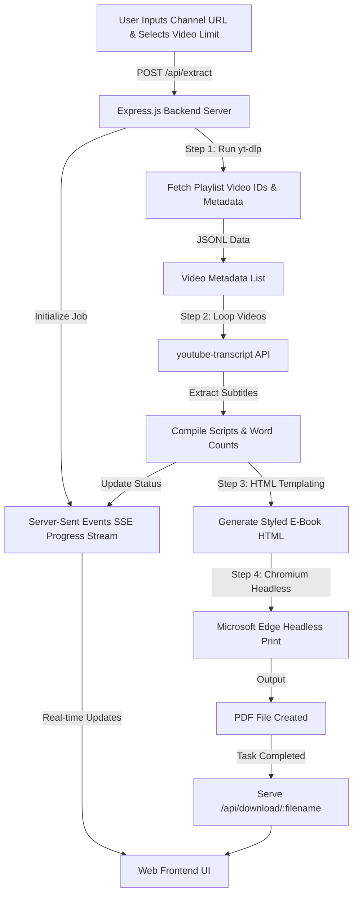

# 🎬 YouTube Script PDF Generator


> **Automated Web Application to extract video transcripts & titles from any YouTube channel and compile them into beautifully formatted PDF E-Books.**

---

## 🌟 Overview

The **YouTube Script PDF Generator** is a full-stack web application designed to fetch video titles, URLs, metadata, and full transcripts (subtitles) from any YouTube Channel handle or URL (e.g., `@CodeWithHarry`, `@TechnicalGuruji`). 

It formats the extracted content into a styled HTML document with **Table of Contents**, video word counts, direct links, and proper typography (including full Unicode Hindi Devanagari font support). It then uses Chromium Headless printing (`msedge --headless`) to render pixel-perfect PDF E-Books ready for offline reading or research.

---

## ✨ Key Features

- 🎯 **Universal Channel Extraction:** Extract video scripts from any YouTube Channel URL or handle (`@channelname`).
- 🎛️ **Custom Video Count Limits:** Flexible extraction scope options (**Latest 10, 20, 50, 80, 100, or ALL Videos**) to handle channels with thousands of uploads.
- ⚡ **Real-Time Live Progress Logging:** Server-Sent Events (SSE) provide live progress bar updates and real-time console status logs directly in the browser.
- 📖 **E-Book Layout & Typography:** Beautifully formatted PDF layout featuring a Cover Page, Table of Contents with jump links, metadata badges, and clean script boxes.
- 🇮🇳 **Full Hindi & Unicode Font Support:** Native integration with `Noto Sans Devanagari`, `Mangal`, and `Nirmala UI` fonts to ensure perfect Hindi Devanagari script rendering.
- 📥 **One-Click Download:** Instant PDF download link served directly upon task completion.

---

## 🎨 User Interface (UI) Overview

The web interface is built using **Tailwind CSS** with a modern dark-mode glassmorphic design:

1. **Header & Navigation Bar:** Displays live server status (`Server Online`) and app identity.
2. **Interactive Input Card:**
   - Input field for YouTube Channel URL or `@handle`.
   - Video limit selector pills (**10, 20, 50, 80, 100, All**).
   - Quick preset buttons for instant testing.
3. **Live Progress Terminal:**
   - Animated gradient progress bar (0% - 100%).
   - Live stream log terminal showing video titles currently being processed.
4. **Success Card:**
   - Direct `Download PDF E-Book` button with instant file download capability.

---

## 🔄 System Architecture & Workflow



---

## 📁 Project Directory Structure

```text
YouTube-Script-PDF-Generator/
├── public/
│   └── index.html          # Web Frontend UI (Tailwind CSS, FontAwesome, SSE client)
├── server.js               # Express Backend Server (API endpoints, SSE, Edge PDF renderer)
├── process_full_channel.js # CLI script for standalone execution
├── yt-dlp.exe              # Standalone YouTube video list metadata scraper
├── package.json            # Node.js dependencies & scripts
├── package-lock.json       # Lockfile
├── .gitignore              # Ignored files (node_modules, generated PDFs/HTML)
└── README.md               # Documentation & Guide
```

---

## 🛠️ Installation & Local Setup

### Prerequisites

- **Node.js** (v18.x or higher)
- **Microsoft Edge** or **Google Chrome** (for headless PDF printing on Windows)

### 1. Clone the Repository

```bash
git clone https://github.com/sonuukush/YouTube-Script-PDF-Generator.git
cd YouTube-Script-PDF-Generator
```

### 2. Install Dependencies

```bash
npm install
```

### 3. Start the Server

```bash
npm start
# OR
node server.js
```

### 4. Open in Browser

Open your browser and navigate to:

👉 **`http://localhost:3000`**

---

## 📡 API Reference

### `POST /api/extract`
Triggers the script extraction and PDF generation workflow.

**Request Body:**
```json
{
  "channelUrl": "@CodeWithHarry",
  "videoLimit": "50"
}
```

**Response:**
```json
{
  "jobId": "job_1787338515257",
  "message": "Extraction started"
}
```

---

### `GET /api/progress/:jobId`
Server-Sent Events (SSE) stream for real-time extraction progress updates.

**Event Data Format:**
```json
{
  "jobId": "job_1787338515257",
  "handle": "@CodeWithHarry",
  "status": "extracting_scripts",
  "message": "Processing [12/50]: \"Python Tutorial for Beginners\"",
  "progress": 35,
  "totalVideos": 50,
  "processedCount": 12,
  "currentVideoTitle": "Python Tutorial for Beginners",
  "pdfUrl": "/api/download/_CodeWithHarry_Top50_scripts.pdf",
  "fileName": "_CodeWithHarry_Top50_scripts.pdf"
}
```

---

### `GET /api/download/:filename`
Serves the generated PDF file for direct download.

---

## 💻 CLI Standalone Usage

You can also run script extraction directly from the command line:

```bash
node process_full_channel.js @channel_handle
```

Example:
```bash
node process_full_channel.js @TechnicalGuruji
```

---

## 🤝 Contributing

Contributions, issues, and feature requests are welcome! Feel free to check the [issues page](https://github.com/sonuukush/YouTube-Script-PDF-Generator/issues).

---

## 📝 License

Distributed under the **MIT License**. See `LICENSE` for more information.

---

<p center="text-center">Made with ❤️ for Content Researchers, Students & Developers</p>
