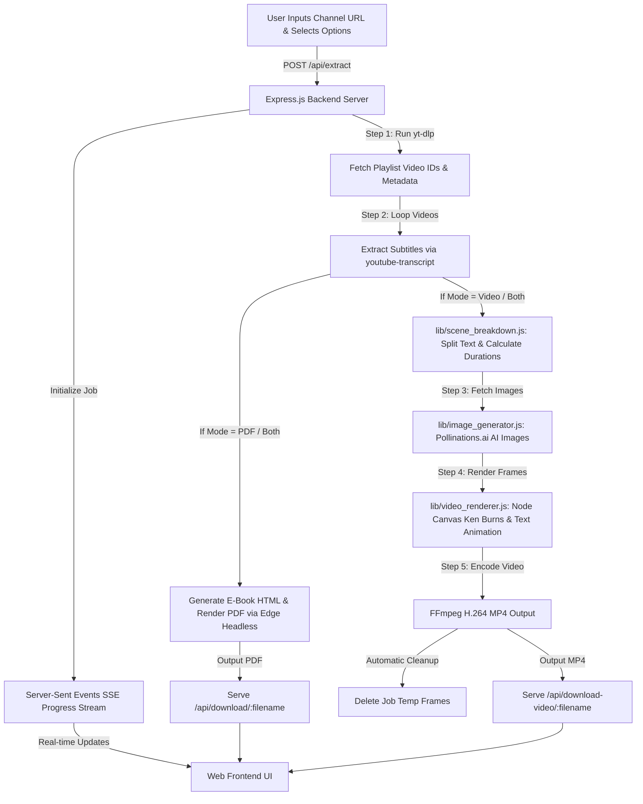

# 🎬 YouTube Script PDF & Kinetic Video Studio


> **Full-Stack Web Application to extract video transcripts & titles from any YouTube channel and generate both PDF E-Books and AI-powered Kinetic Typography MP4 Videos (16:9 & 9:16).**

---

## 🌟 Overview

The **YouTube Script PDF & Kinetic Video Studio** is an automated Web Application that fetches video titles, URLs, metadata, and full transcripts (subtitles) from any YouTube Channel handle or URL (e.g., `@CodeWithHarry`, `@TechnicalGuruji`). 

It provides **three output generation modes**:
1. 📕 **PDF E-Book Mode**: Compiles channel video scripts into a styled PDF E-Book with Table of Contents, word counts, and proper Devanagari Hindi font support.
2. 🎬 **Kinetic Typography Video Mode**: Splits video transcript text into kinetic scene chunks, downloads custom AI background images per scene from Pollinations.ai (Flux AI Model), applies Ken Burns slow zoom effects and animated text overlays, and encodes MP4 kinetic videos.
3. 🌟 **Both (PDF + Video)**: Generates both PDF E-Books and MP4 videos simultaneously.

---

## ✨ Key Features

- 🎯 **Universal Channel Extraction:** Extract video scripts from any YouTube Channel URL or handle (`@channelname`).
- 🎛️ **Custom Video Count Limits:** Flexible extraction scope options (**Latest 10, 20, 50, 80, 100, or ALL Videos**) to handle channels with thousands of uploads.
- 📱 **Multi-Aspect Ratio Video Output:**
  - 📺 **16:9 Landscape** (1280x720 for YouTube Long-form)
  - 📱 **9:16 Portrait** (720x1280 for Shorts, Instagram Reels & TikTok)
- 🖼️ **Pollinations.ai Free AI Scene Backgrounds:** Automatically generates visual image prompts from scene text and fetches HD background photos (with automatic fallback to dark gradient backgrounds).
- 🎬 **Kinetic Text & Ken Burns Engine:** Pure Node.js video renderer using `@napi-rs/canvas` and `fluent-ffmpeg` for Ken Burns background zoom, text pop-in, and emoji overlays.
- 🇮🇳 **OS-Independent Hindi & Devanagari Font Support:** Bundles `assets/fonts/mangal.ttf` directly within the repository to guarantee flawless Hindi character rendering across Windows, Linux, macOS, and Docker environments.
- 🧹 **Automatic Disk Space Cleanup:** Automatically purges temporary image frames (`temp_jobs/{jobId}/`) upon MP4 render completion to prevent disk clutter.
- ⚡ **Real-Time SSE Live Progress Stream:** Live progress bar (0% - 100%) and streaming console logs directly in the browser.

---

## 🔄 System Architecture & Workflow



---

## 📁 Project Directory Structure

```text
YouTube-Script-PDF-Generator/
├── assets/
│   └── fonts/
│       └── mangal.ttf          # OS-Independent Devanagari Font
├── lib/
│   ├── scene_breakdown.js      # Text chunker, reading speed duration & emoji inferrer
│   ├── image_generator.js      # Pollinations.ai AI background image fetcher & fallbacks
│   └── video_renderer.js       # Node Canvas + FFmpeg video rendering engine & cleanup
├── public/
│   └── index.html              # Web Frontend UI (Tailwind CSS, Output Mode & Aspect Ratio UI)
├── output_videos/              # Rendered MP4 output videos
├── server.js                   # Express Backend Server & API routes
├── process_full_channel.js     # CLI script for standalone execution
├── yt-dlp.exe                  # Standalone YouTube video list metadata scraper
├── package.json                # Dependencies & scripts
└── README.md                   # Complete Documentation
```

---

## 🛠️ Installation & Local Setup

### 1. Clone the Repository

```bash
git clone https://github.com/sonuukush/YouTube-Script-PDF-Generator.git
cd YouTube-Script-PDF-Generator
```

### 2. Install Dependencies

```bash
npm install
```

### 3. Start the Server

```bash
npm start
# OR
node server.js
```

### 4. Open in Browser

Open your browser and navigate to:

👉 **`http://localhost:3000`**

---

## 📡 API Endpoints

- `POST /api/extract`: Accepts `{ channelUrl, videoLimit, outputMode, aspectRatio }`.
- `GET /api/progress/:jobId`: SSE stream for live progress tracking.
- `GET /api/download/:filename`: Downloads generated PDF E-Book.
- `GET /api/download-video/:filename`: Downloads generated Kinetic MP4 Video.

---

<p align="center">Made with ❤️ for Content Creators, Researchers & Developers</p>
